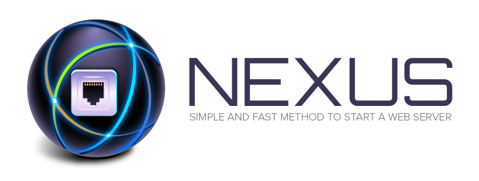

## Welcome

Nexus is a simple and fast method to start a web server.

> Note: tested on **Linux** and **Mac**.

## Requirements

- [PHP v5.4+](http://www.php.net/)
- [Python v2.6+](https://www.python.org/)

> **Important:** make sure you start the web server inside the current project directory.


## Installation

```bash

# 1. Clone this repository
$ git clone git://github.com/vitorbritto/nexus.git

# 2. Place the `nexus.sh` script wherever you want

# 3. Make the script executable
$ chmod u+x path/to/nexus.sh

```


## Usage

    $ ./nexus.sh [options] [commands] <port>

> Note: `<port>` is optional

### Options:

    -l, --linux     Using Linux
    -m, --mac       Using Mac
    -h, --help      Output this help text

### Commands:

    php             Start a webserver with PHP
    py              Start a webserver with Python


## Bonus

If you prefer, put the following **alias** inside your `.bashrc` file:

    # Mac
    alias nexuspy="bash ~/path/to/script/nexus.sh -m py"
    alias nexusphp="bash ~/path/to/script/nexus.sh -m php"

    # Linux
    alias nexuspy="bash ~/path/to/script/nexus.sh -l py"
    alias nexusphp="bash ~/path/to/script/nexus.sh -l php"

Now, you can simply run:

    $ nexuspy <port>

    OR

    $ nexusphp <port>


## License

[MIT License](http://vitorbritto.mit-license.org/) © Vitor Britto
